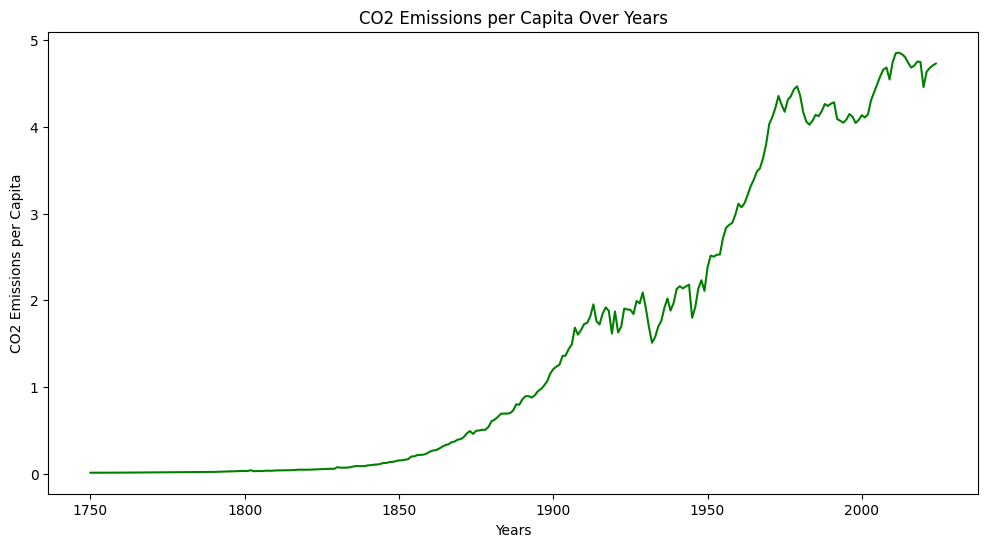

# The Rise of CO₂ and Global Temperature

A data-driven climate analysis project based on historical CO₂ emissions per capita and global temperature anomaly records.

## Research Question

### Question

How did CO₂ emissions change during and after industrialization, and how strongly are these changes associated with global temperature rise?

### Description

This study evaluates long-term trends in carbon emissions and temperature anomalies, then integrates both datasets to quantify their relationship using correlation analysis and linear regression.

## What is Global Warming and Temperature Change?

Global warming refers to the long-term increase in Earth’s average surface temperature. In this project, temperature change is represented by global temperature anomaly, which measures each year’s deviation from a historical baseline.

## Industrialization Period

Industrialization began in the mid-18th century and expanded significantly after 1900, with substantial acceleration after 1950. The increased use of fossil fuels during this period is reflected in the sharp rise in carbon emissions.

## CO₂ Rise (CO₂ Plot)

The CO₂ emissions per capita trend remains comparatively low in earlier years and then rises sharply during the modern industrial era, particularly after 1950. This pattern indicates a sustained structural increase in carbon output associated with industrial expansion, rising energy demand, and large-scale fossil fuel consumption.

## Temperature Rise from the Industrial Period

The temperature anomaly series shows a comparable upward pattern over time. Although early values fluctuate around lower levels, the later industrial period exhibits stronger and more frequent positive anomalies. Visually, the temperature trend increases alongside the CO₂ trend, indicating that both series accelerate in a similar direction.

## Merged Plot and Regression Relationship

After merging CO₂ per capita and temperature anomaly by year, the scatter plot demonstrates a clear positive relationship. Regression and correlation outputs indicate a strong association between rising CO₂ levels and higher global temperature anomaly values:

- Correlation: **0.815**
- R²: **0.6646**
- Post-1950 warming rate: **about 4x higher** than the earlier period

These results provide strong statistical support for the relationship observed in the historical record analyzed in this project.

## Conclusion

This analysis shows that both CO₂ emissions and global temperature anomalies increase substantially across the industrial and post-industrial periods. The merged dataset and regression metrics support a clear positive relationship between higher emissions and higher temperature anomalies.

- Correlation: **0.815**
- R²: **0.6646**
- Post-1950 warming rate: **about 4x higher** than the earlier period

## Resources Used

- Our World in Data — CO₂ emissions per capita dataset
- NASA GISTEMP — global temperature anomaly dataset
- Python libraries: pandas, matplotlib, seaborn, scikit-learn, and numpy

## Thanks

Thank you for reviewing this climate analysis project for the Codedex Dataset Challenge.
